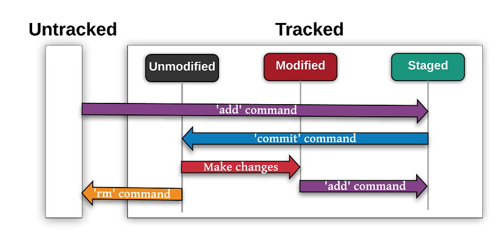

# GIT

Git is a distributed version control system, which tracks changes in computer files, primarily used for coordinating development work by the programmers during software development process.

#### Meaning:

- It tracks every change you make to your project, so you can:

- go back to any old version

- see what changed

- who changed it

- when they changed it

- work on new features without breaking existing code

## Basics Git Commands

### 1. git init

git init initializes a new Git repository inside a folder.

It turns a normal folder into a version-controlled project by creating the hidden .git directory.

What Happens When You Run git init

Git creates:

```
.git/
 ├── HEAD
 ├── config
 ├── hooks/
 ├── objects/
 └── refs/

```

This folder stores:

- your commits

- branches

- history

- uconfiguration

**Without .git, Git cannot track anything.**

### Usage: -

#### Initialize in a folder

```git
git init        //initialize git in current folder
```

#### Initialize a repo with a specific default branch

```git
git init -b main      //Initialize a repo with a main branch
```

## **Git States**

Git tracks every file through four states:

1. Untracked

2. Unmodified

3. Modified

4. Staged

   

### 2. git add

git add moves changes from the Working **Directory → Staging Area**.

**stages everything**

    git add .

**Stage only modified + deleted, not untracked**

    git add -u

**Stage all tracked files (modified + deleted)**

    git add -A

### 3. git commit

git commit permanently saves the staged changes into the repository as a snapshot in time.

A commit contains:

- a unique hash

- author

- timestamp

- commit message

- the staged file snapshots

normal commit

    git commit -m "Add login validation"

Commit Skipping Staging (commit all tracked changes)

    git commit -am "Fixed bugs"

- -a only works for tracked files

- It does not add untracked files

### 4. git log

git log shows the history of commits in your repository.

It displays:

- commit hash

- author

- date

- commit message

- optional refs (HEAD, tags, branches)

This is your timeline of the project.

    git log

Graph View (very useful for branches & merges)

    git log --oneline --graph --all

Show commits of a specific file

    git log file.js

Show author-specific commits

    git log --author="aniket"

### 5. git show

git show displays details about a specific object (usually a commit).

It shows:

- commit metadata

- commit message

- diff (changes made in that commit)

**Show the most recent commit**

    git show

Show a commit by its hash

    git show a1b2c3d    // git show <commit-hash>

output format: -

```
commit a1b2c3d
Author: Aniket <aniket@xyz.com>
Date:   Thu Dec 4 12:14 2025

    Fix: corrected API response type

diff --git a/app.js b/app.js
index 1234567..8910111 100644
--- a/app.js
+++ b/app.js
@@ -10,7 +10,7 @@ function getUser() {
-    return oldData;
+    return newData;
 }
```
